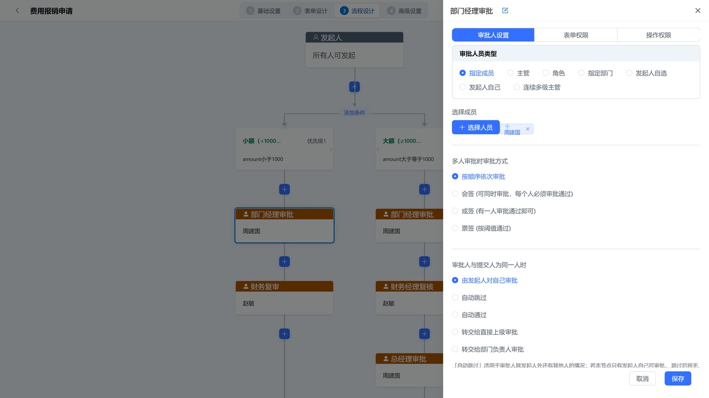
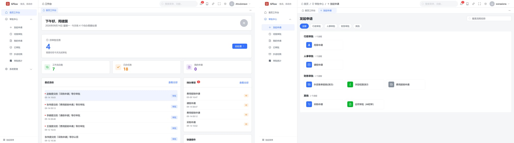
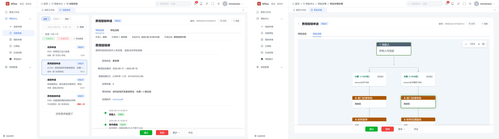
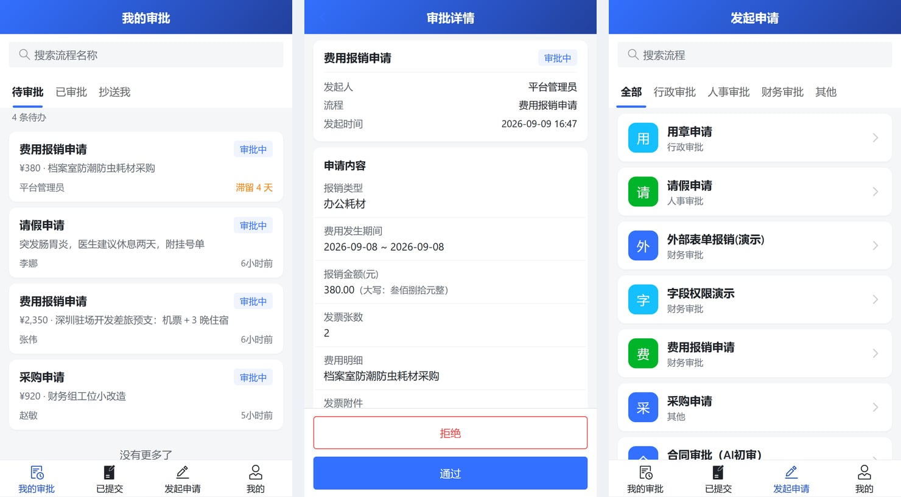
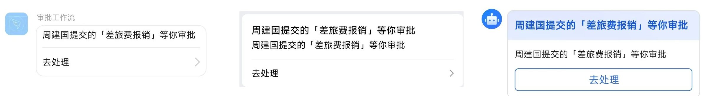

# GFlow Engine

[](https://pkg.go.dev/github.com/rulego/gflow-engine)
[](https://goreportcard.com/report/github.com/rulego/gflow-engine)

[English](README_EN.md) | 简体中文

> **GFlow** —— AI 先审 · 人再签 · 签完自动办

`GFlow Engine` 是一个基于 [RuleGo](https://github.com/rulego/rulego) 的轻量级、可嵌入审批工作流引擎。流程定义复用 `RuleGo` 规则链 DSL（JSON），审批任务、流程实例、历史归档等状态由引擎持久化到关系数据库，无需部署独立的流程中间件。审批节点与自动化节点（规则链、HTTP、AI 智能体、子流程）在同一条流程 DSL 里混排——审批通过即可自动执行后续动作；或签、会签、动态加签/减签、退回等中国式审批语义开箱即用。

> 注意：DSL 为 JSON 格式的类 BPMN 审批流，不解析 BPMN 2.0 XML。

## 特性

* **中国式审批语义，开箱即用**：或签、会签、票签（过半/百分比/指定票数）、顺序审批、动态加签/减签、转办、委派、签收/抢单、退回、撤回、超时催办，无需二次开发；流程定义支持多版本共存，存量实例按启动时的版本继续跑完。
* **审批与自动化在一条流程里**：流程 DSL 复用 `RuleGo` 规则链，审批节点可与条件分支、并行分支、规则链、HTTP 调用、AI 智能体、子流程自由编排——审批通过即自动执行后续动作（入账、通知、回写业务系统）。
* **可嵌入宿主，身份权限宿主掌控**：纯 Go 库集成，不绑定用户体系；审批人按人员/角色/部门/多级主管解析（`IdentityService`）；每个操作都校验办理人权限，全链路多租户隔离。
* **轻量可靠**：无需消息队列等外部中间件；PostgreSQL / MySQL 开箱即用（方言可扩展达梦、人大金仓等）；运行时/历史双表分离，审计报表不拖累线上；17 个任务事件钩子驱动通知等副作用（[docs/events.md](docs/events.md)）。

## GFlow Platform（企业版）

**GFlow Platform（极风工作流）** 是基于 GFlow Engine 打造的开箱即用审批工作流平台（即 GFlow 企业版），前端后端全套：

- **审批中心**：发起申请、待办 / 已办 / 抄送我、审批统计，审批全流程开箱即用
- **流程设计器 + 表单设计器**：业务人员拖拽搭建流程和表单，不写代码
- **AI 审批**：AI 智能体加入审批流，完成单据初审
- **IM 集成**：审批待办实时推送钉钉 / 企业微信 / 飞书工作通知，点开卡片免登直达办理，通讯录同步与账号绑定开箱即用
- **管理端**：流程定义、实例、任务、自动化、组织权限一站管理

- 官网：<https://gflow.rulego.cc/>
- 在线演示：<http://8.134.32.225:8081>（`admin` / `admin123`）

## 界面预览

以下为 GFlow Platform 的真实界面截图。

<p align="center">
  
  <br/><sub><b>流程设计器</b> —— 树形画布 + 审批配置抽屉，业务人员零代码上手</sub>
</p>

<p align="center">
  
  <br/><sub><b>工作台 · 发起申请</b> —— 待办一屏掌握，选模板填表单、一分钟发起</sub>
</p>

<p align="center">
  
  <br/><sub><b>审批中心 · 审批详情</b> —— 收件箱式待办；时间线展示条件命中与后续每个环节谁来审</sub>
</p>

<p align="center">
  
  <br/><sub><b>移动端 H5</b> —— 手机上直接发起申请、处理审批、查看进度</sub>
</p>

<p align="center">
  
  <br/><sub><b>IM 工作通知</b> —— 审批待办推送钉钉 / 企业微信 / 飞书，点开卡片免登直达办理</sub>
</p>

## 安装

```bash
go get github.com/rulego/gflow-engine
```

要求 Go 1.24+、RuleGo v0.37+。数据库表初始化脚本为 `scripts/00.init_bpm_pg.sql`（PostgreSQL）与 `scripts/00.init_bpm_mysql.sql`（MySQL），初始化与升级说明见 [docs/migration.md](docs/migration.md)。

## 初始化数据库

引擎只维护自己的工作流表，用户/角色/部门等系统表由宿主应用负责。

**PostgreSQL：**

```bash
createdb gflow   # 首次使用先建库（或 psql -c "CREATE DATABASE gflow"）
psql -d gflow -f scripts/00.init_bpm_pg.sql
```

**MySQL：**

```bash
mysql -u root -p -e "CREATE DATABASE gflow DEFAULT CHARACTER SET utf8mb4"
mysql -u root -p gflow < scripts/00.init_bpm_mysql.sql
```

引擎共 7 张 `wf_` 前缀表：流程定义、实例与任务（各含运行时/历史两张）、候选人池、审批意见，字段说明见 [docs/migration.md](docs/migration.md)。

## 快速开始

建议先跑通完整示例再动手集成（部署 → 发起 → 审批 → 查询实例状态一条龙，内存 SQLite 零依赖）：

```bash
go run ./examples/leave_approval
```

最小集成代码：

```go
package main

import (
	"context"
	"log"

	"github.com/rulego/gflow-engine/components"
	"github.com/rulego/gflow-engine/config"
	"github.com/rulego/gflow-engine/model"
	"github.com/rulego/gflow-engine/service"
)

func main() {
	ctx := context.Background()

	// 1. 数据库配置并启动引擎
	cfg := &config.Config{
		Database: &config.DatabaseConfig{
			Driver: "postgres",
			Dsn:    "host=127.0.0.1 user=postgres password=postgres dbname=gflow port=5432 sslmode=disable",
		},
	}
	engine, err := service.NewWorkflowEngineBuilder().
		SetName("demo").
		SetConfig(cfg).
		SetIDGenerator(service.NewIDGenerator()).
		Build()
	if err != nil {
		log.Fatalf("build engine: %v", err)
	}
	if err := engine.Start(ctx); err != nil {
		log.Fatalf("启动引擎失败: %v", err)
	}
	defer engine.Stop(ctx)

	// 2. 注册工作流节点组件（userTask/serviceTask/automation/...）
	//    依赖由引擎自取；宿主自己的服务函数经 WithServiceFuncs 注册，见 docs/components.md。
	//    注意：必须先 engine.Start 成功，否则注册会报错拦截。
	if err := components.RegisterFromEngine(engine); err != nil {
		log.Fatalf("注册组件失败: %v", err)
	}

	// 3. 部署流程定义（DSL 为 rulego 规则链 JSON，见 examples/leave_approval）。
	//    所有变更类操作的第一个业务参数都是显式 actor——用于审计与权限校验的操作人。
	admin := service.Actor{UserID: "admin", UserName: "admin", TenantID: "default"}
	_, err = engine.GetProcessService().Deploy(ctx, admin, &model.WfProcess{
		ProcessKey:     "leave_approval",
		Name:           "请假审批",
		DefinitionJSON: leaveApprovalDSL, // 流程 DSL JSON，内容参考 examples/leave_approval/dsl.json
		TenantID:       "default",
		CreatedBy:      "admin",
	}, true)
	if err != nil {
		log.Fatalf("部署流程失败: %v", err)
	}

	// 4. 发起流程实例（追加可变参数 service.WithDraft() 即草稿模式；普通启动不传）
	instanceID, err := engine.GetRuntimeService().StartProcessInstanceByKey(
		ctx,
		service.Actor{UserID: "emp001", UserName: "张三", TenantID: "default"},
		"leave_approval",
		"leave_emp001_1", // 业务键
		map[string]interface{}{"days": 5, "managerId": "mgr001", "reason": "家中事务"},
	)
	if err != nil {
		log.Fatalf("发起流程失败: %v", err)
	}
	log.Printf("实例已发起: %s", instanceID)
}
```

审批人处理待办（需额外引入 `github.com/rulego/gflow-engine/types/dto` 与 `.../types/enums`）：

```go
tasks, _, err := engine.GetTaskService().GetTaskList(ctx, service.Actor{
	UserID:   "mgr001",
	TenantID: "default",
}, &dto.TaskQuery{
	Assignee: "mgr001",
	PageRequest: dto.PageRequest{
		Status:   []string{string(enums.TaskStatusPending), string(enums.TaskStatusActive)},
		PageSize: 10,
	},
})
if err != nil || len(tasks) == 0 {
	return
}

err = engine.GetTaskService().CompleteWithApproval(ctx, service.Actor{
	UserID:   "mgr001",
	TenantID: "default",
}, &service.ApprovalRequest{
	TaskID:         tasks[0].ID,
	ApprovalResult: enums.ApprovalResultApproved,
	Comment:        "同意",
})
```

完整可运行示例（单签、会签、顺序审批）见 [examples/leave_approval](examples/leave_approval)——默认跑在内存 SQLite 上，零依赖直接运行（`GFLOW_DSN` 可切 PostgreSQL/MySQL）；`httpCall` + `switch` 组合示例（查询外部接口 → 响应映射进流程变量 → 按结果路由）见 [examples/http_call](examples/http_call)。引擎默认内置内存 Mock 身份服务（仅用于测试），生产集成请按下一节注入自己的 `IdentityService`。

## 接入组织架构（IdentityService）

引擎不绑定任何用户体系。按角色/部门/主管发起的审批任务，办理人统一通过 `service.IdentityService` 接口解析——生产环境必须注入宿主应用自己的实现（对接真实的用户/角色/部门表），内置的内存 Mock 仅供测试：

```go
// 实现 service.IdentityService 的全部 9 个方法，对接你自己的组织架构表
type OrgIdentityService struct {
	db *gorm.DB // 宿主应用数据源
}

// 按角色查用户（role 候选任务展开），其余方法同理
func (s *OrgIdentityService) GetUserIDsByRoleID(ctx context.Context, tenantID, roleID string) ([]string, error) {
	var userIDs []string
	err := s.db.WithContext(ctx).
		Table("user_roles").
		Where("tenant_id = ? AND role_id = ?", tenantID, roleID).
		Pluck("user_id", &userIDs).Error
	return userIDs, err
}

// 其余待实现方法与用途：
//   GetUserIDsByDepartmentID        按部门查用户（dept 候选任务）
//   GetDepartmentManagerUserID      查部门主管（dept 候选任务）
//   GetUserManagerID                查直接主管（manager 候选任务）
//   GetUserManagerHierarchy         查多级主管（multi_level_manager 候选任务）
//   GetUserDepartmentID             按用户反查部门
//   GetRoleIDsByUserID              按用户反查角色（role 候选任务的待办可见性）
//   GetDepartmentIDsByUserID        按用户反查部门列表（dept 候选任务的待办可见性）
//   GetUserIDsByGroupID             按自定义组查用户（预留扩展）
```

通过 Builder 注入：

```go
engine, err := service.NewWorkflowEngineBuilder().
	SetName("demo").
	SetConfig(cfg).
	SetIdentityService(&OrgIdentityService{db: gormDB}).
	Build()
```

审批人配置（`approver.type`）与接口方法的对应关系：

| approver.type | 解析用的接口方法 |
|---|---|
| `user` | 无需身份服务（`userIds` 直接给用户 ID） |
| `role` | `GetUserIDsByRoleID`；待办可见性走 `GetRoleIDsByUserID` |
| `dept` | `GetUserIDsByDepartmentID` / `GetDepartmentManagerUserID`；待办可见性走 `GetDepartmentIDsByUserID` |
| `manager` | `GetUserManagerID` |
| `multiLevelManager` | `GetUserManagerHierarchy` |
| `initiatorSelect` / `initiatorSelf` | 无需身份服务（发起人自选 / 发起人本人） |

> 可选加固：宿主实现若同时实现 `TenantMembershipChecker` 接口（`IsUserInTenant`），引擎会在转办/委派/改派时校验目标用户属于任务租户，阻断跨租户转派；未实现时跳过校验并告警留痕。

## 流程 DSL

流程定义是一条 `RuleGo` 规则链：`nodes` 描述节点，`connections` 描述流转边，表单和审批配置写在节点 `configuration` 中。BPM 扩展节点如下：

| 节点 type | 说明 |
|---|---|
| `startTask` | 发起节点：流程起点标记，不做鉴权 |
| `userTask` | 用户审批任务：或签/会签、候选人（人员/角色/部门）、表单（`formKey` 透传到 `wf_task.form_key`）、优先级、截止时间；`configuration.taskName`/`taskDescription` 可覆盖节点名与描述 |
| `ccTask` | 抄送任务：生成抄送记录并通过 `CCTaskCreatedListener` 回调宿主应用 |
| `serviceTask` | 服务任务：调用 Go 函数（经 `action.Functions` 注册） |
| `automation` | 自动化节点：调用 `RuleGo` 规则链 |
| `subProcess` | 子流程：启动独立子流程实例，结束后回到主流程 |
| `aiAgent` | AI 智能体节点：调用智能体规则链并路由输出 |
| `httpCall` | HTTP 调用：同步请求外部接口，响应按映射合并进流程变量 |
| `startProcess` | 规则链专用：链内发起 BPM 流程实例（如定时自动发起审批） |

`RuleGo` 原生节点（`switch` 条件分支、`fork`/`inclusive`/`join` 并行汇聚等）可直接参与编排，详见 [RuleGo 标准组件](https://rulego.cc/pages/standard-components/)。

各节点的完整参考（配置字段、审批模式、驳回策略、`httpCall` SSRF 防护）见 [docs/components.md](docs/components.md)。面向集成者的完整文档（任务生命周期、事件、数据模型）索引见 [docs/README.md](docs/README.md)。

## 扩展点

* **身份服务：** 实现 `service.IdentityService`，按角色/部门/组/多级主管解析审批人。
* **数据库方言：** 实现 `service.DialectProvider` 注册新数据库，见 [examples/custom_dialect](examples/custom_dialect)（达梦、人大金仓）。
* **分布式锁：** 引擎内置本地内存锁（`lock.NewLocalLock`）；多实例部署请自行实现 `lock.Locker` 接口（如基于 Redis 的 SET NX + Lua 脚本释放），并经 `WorkflowEngineBuilder.SetLocker` 注入。
* **任务事件：** `TaskEventListener` / `CCTaskCreatedListener` 接收任务生命周期事件，驱动站内通知等副作用；完整事件目录、载荷字段与对接示例见 [docs/events.md](docs/events.md)。

## 联系与商业授权

GFlow Engine 按 Apache-2.0 开源免费使用。如需源码交付、开箱即用的企业版
**GFlow Platform**（极风工作流，含流程/表单设计器、审批界面、AI 审批）或商业支持，
请访问 <https://gflow.rulego.cc/>，或通过以下方式联系（添加烦请注明来意）：

- QQ：[2215016127](tencent://message/?uin=2215016127&Site=&Menu=yes)
- 微信：`rulegoteam`
- 邮件：[rulego@outlook.com](mailto:rulego@outlook.com)

## 许可

`GFlow Engine` 使用 Apache 2.0 许可证，详情请参见 [LICENSE](LICENSE) 文件。
